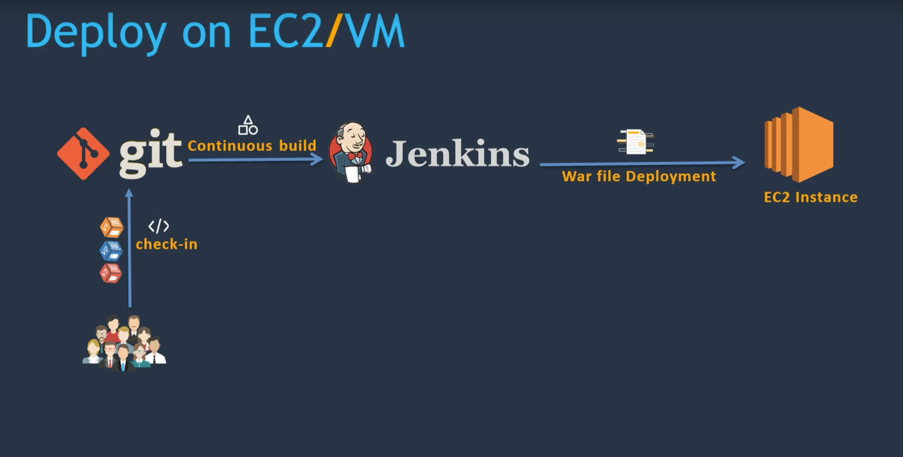
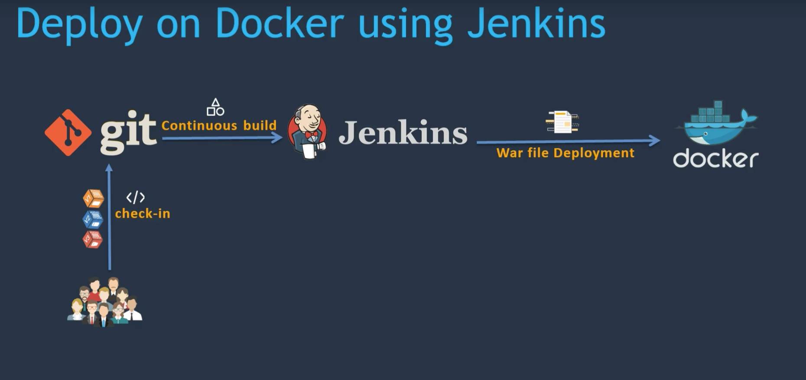

## Tools used in this project
* DevOps Tools
  * git
  * Jenkins
  * maven
  * ansible
  * docker
  * kubernets
  * aws

* DevOps Flow

## Topics Covered
* Introduction
  * Introduction to CI/CD
  * Tools used to setup DevOps flow

* Setup CI/CD with Jenkins, git, Maven and Tomacat
  * Setup jenkins
  * Run a test job
  * Setup Et configure Maven and Git
  * Setup Tomcat Server
  * Installing additional required plugins
  * Integreting Git, Maven in Jenkins job
  * Run CI/CD job

* Deploy on EC2/VM

* Introducing Docker
  * Setting up Docker environment
  * Managing Docker with Ansible
  * DockerHub repository
  * Writing a Docker file
  * Run a job
  
* Deploy on Docker using jenkins

