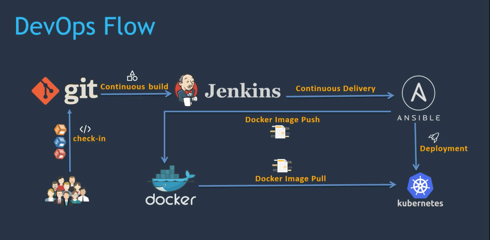
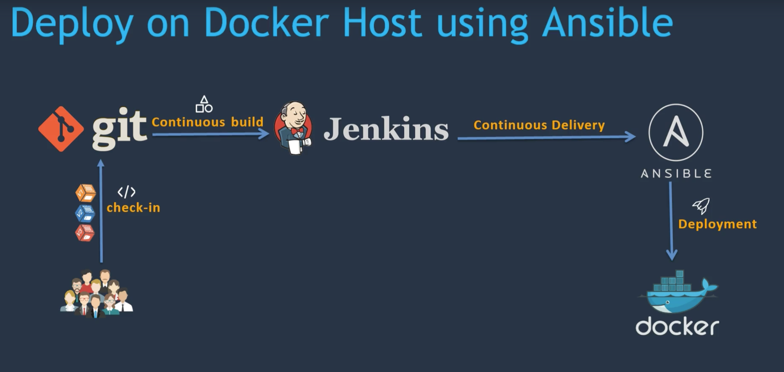
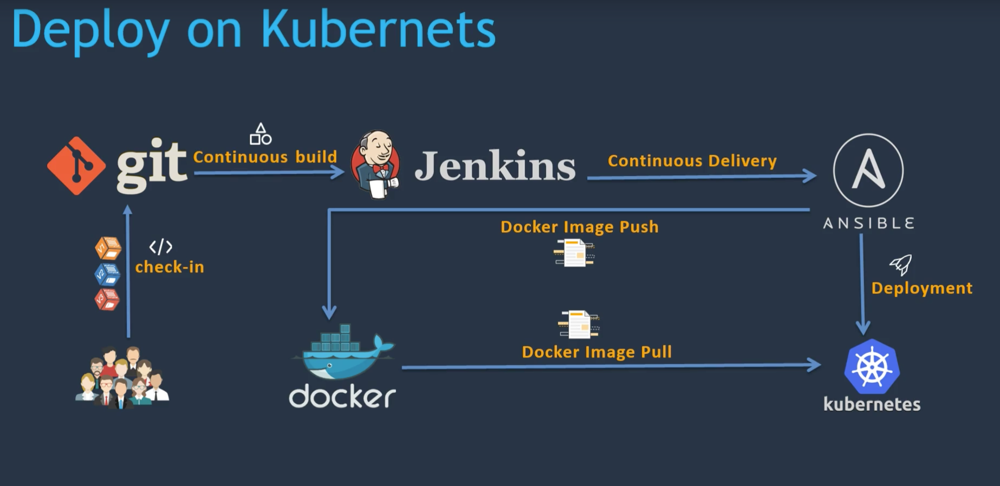
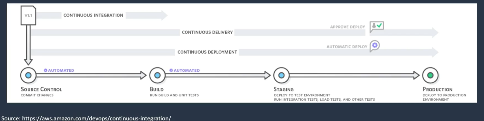
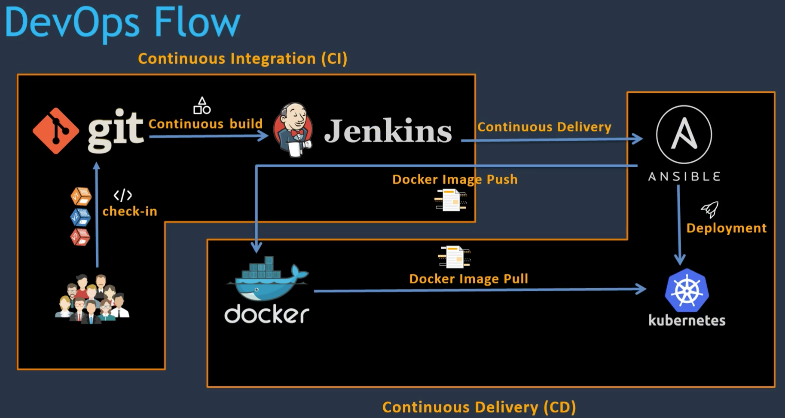
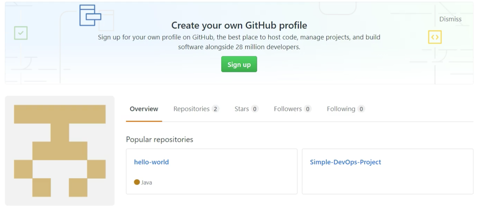
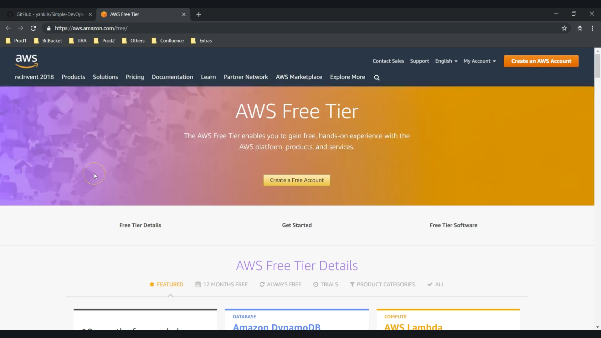

# Introduction

## Contents

* [Tools used in this project](#tools)
* [Topics Covered](#topics)
* [What is CI/CD ?](#cicd)
* [Resource to setup Simple CI/CD Pipeline](#resource)

## Tools used in this project

* DevOps Tools
  * git
  * Jenkins
  * maven
  * ansible
  * docker
  * kubernets
  * aws

* DevOps Flow

### [Return to Contents](#contents)

## Topics Covered

* Introduction
  * Introduction to CI/CD
  * Tools used to setup DevOps flow

* Setup CI/CD with Jenkins, git, Maven and Tomacat
  * Setup jenkins
  * Run a test job
  * Setup Et configure Maven and Git
  * Setup Tomcat Server
  * Installing additional required plugins
  * Integreting Git, Maven in Jenkins job
  * Run CI/CD job

* Deploy on EC2/VM

* Introducing Docker
  * Setting up Docker environment
  * Managing Docker with Ansible
  * DockerHub repository
  * Writing a Docker file
  * Run a job
  
* Deploy on Docker using Jenkins

* Integration with Ansible
  * Setting up Ansible environment
  * Integrating Ansible with jenkins
  * Writing a Ansible playbook to deploy on container
  * Run a job

* Deploy on Docker Host using Ansible

* Introducing Docker
  * Setting up Docker environment
  * Managing Docker with Ansible
  * DockerHub repository
  * Writing a Docker file
  * Run a job

* Introducing Kubernetes
  * Setting up Kubernetes environment
  * Writing deployment and service files
  * Run a job

* Deploy on Kubernetes

### [Return to Contents](#contents)

## What is CI/CD ?

* CI/CD
  * Continuous Integration (CI)
  * Continuous Delivery (CD)
  * Continuous Deployment (CD)

* DevOps Flow

### [Return to Contents](#contents)

## Resource to setup Simple CI/CD Pipeline

* Please make 2 repositories
  * Please clone below Github repositories before starting this course.
    * [https://github.com/yankils/hello-world](https://github.com/yankils/hello-world)
    * [https://github.com/yankils/Simple-DevOps-Project](https://github.com/yankils/Simple-DevOps-Project)
    * [Technical discussion group:](https://www.facebook.com/groups/valaxytechnologies)

* Please make AWS account

### [Return to Contents](#contents)
