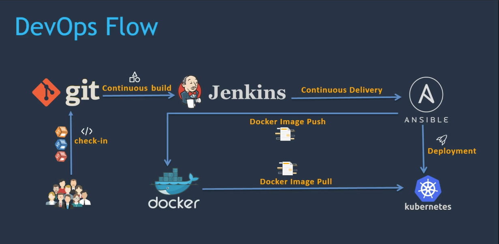

# CI/CD pipeline using Git, Jenkins and Maven

## Contents

* [Tools used in this project](#tools)
* [Topics Covered](#topics)
* [What is CI/CD ?](#cicd)
* [Resource to setup Simple CI/CD Pipeline](#resource)

## Tools used in this project

* DevOps Tools
  * git
  * Jenkins
  * maven
  * ansible
  * docker
  * kubernets
  * aws

* DevOps Flow

### [Return to Contents](#contents)

