# CI/CD pipeline using Git, Jenkins and Maven

<a id="contents"></a>

## Contents

* [Installing Jenkins](#jenkins)


<a id="jenkins"></a>

## Installing Jenkins

### 1st : AWS Management Console

* Flow of Create AWS Management Console
  * 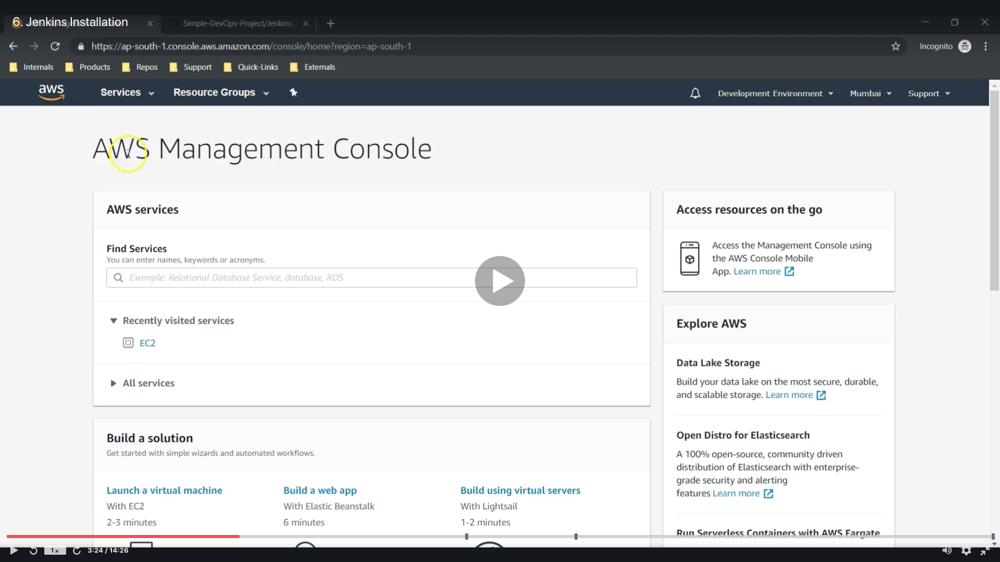
  * 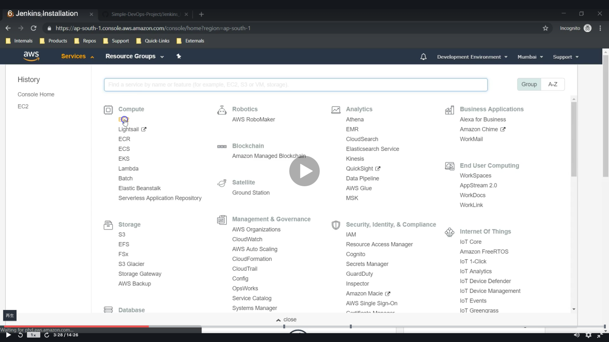
  * 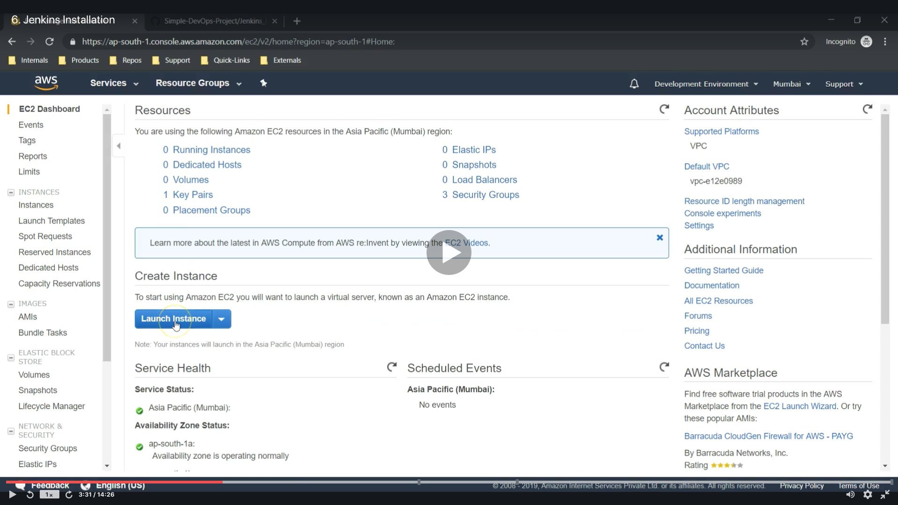
  * 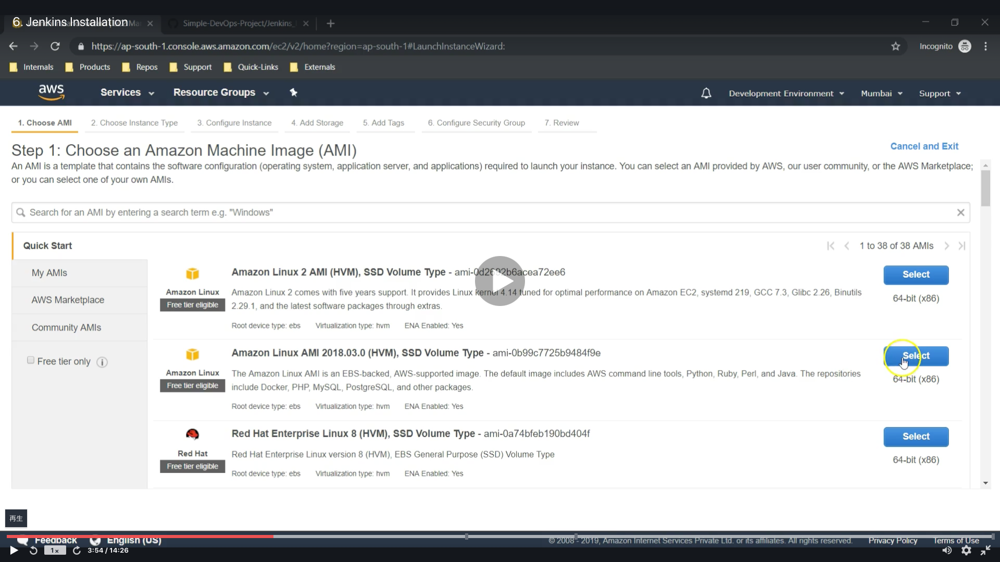
  * 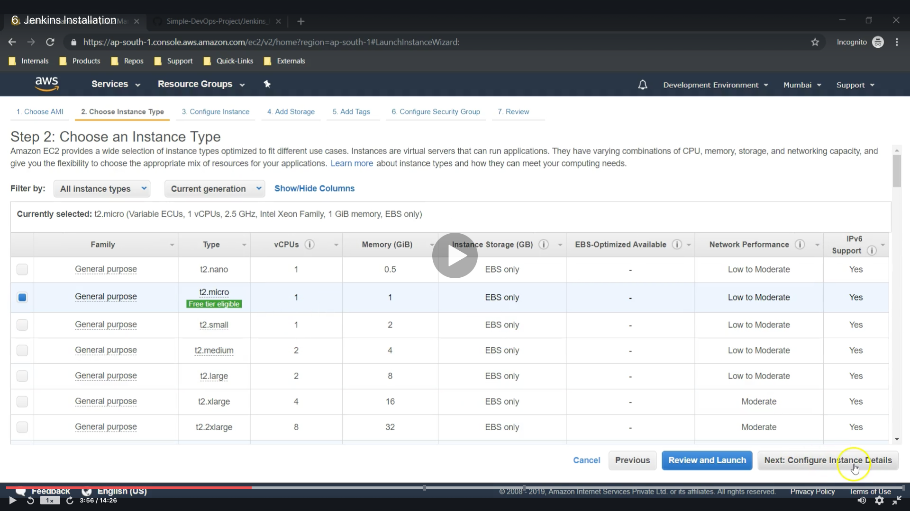
  * 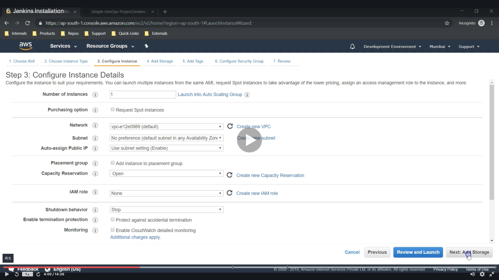
  * 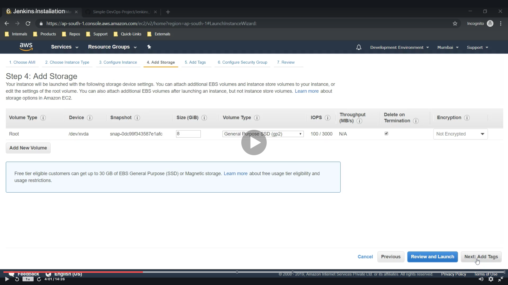
  * 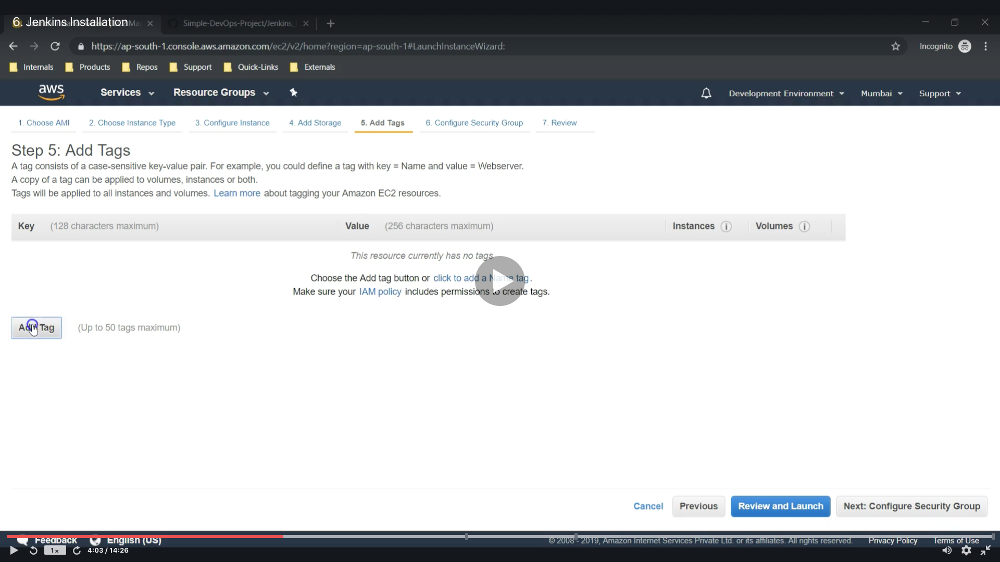
  * 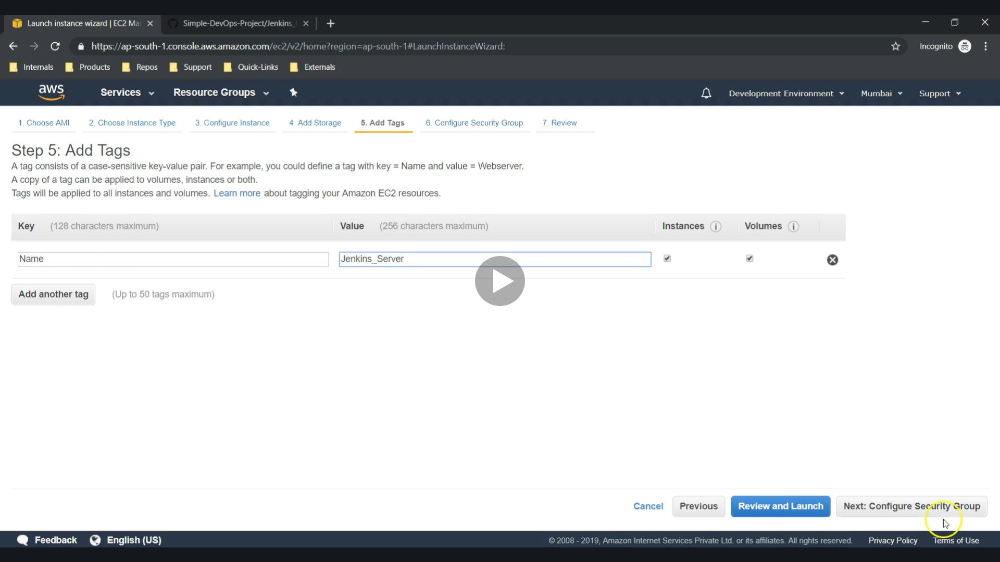
  * 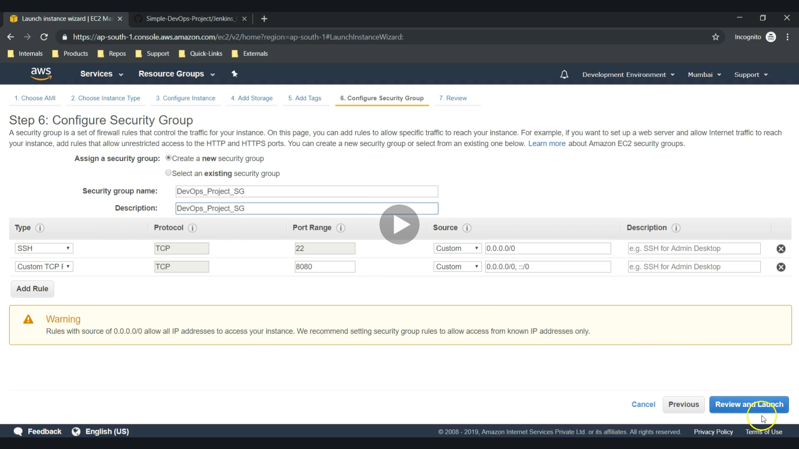
  * 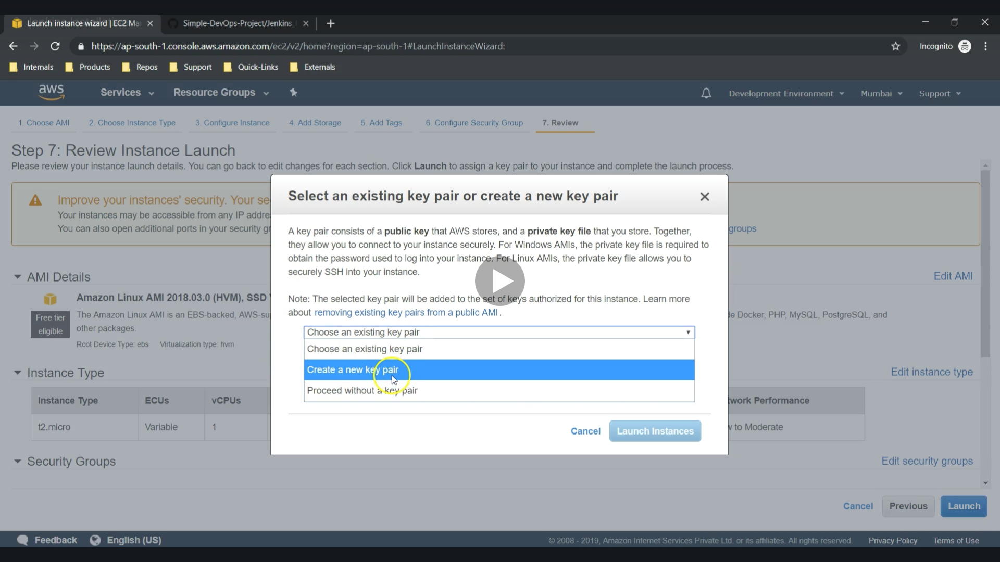
  * 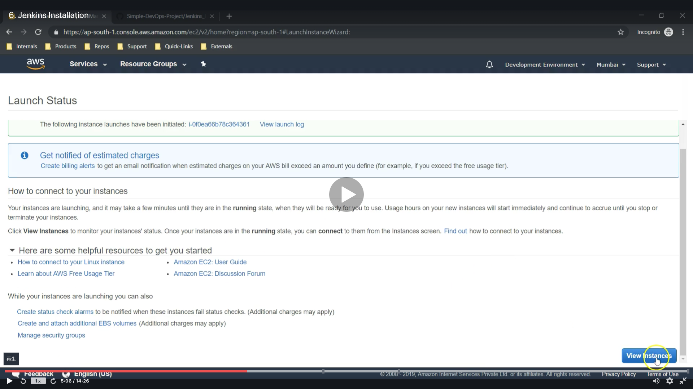
  * 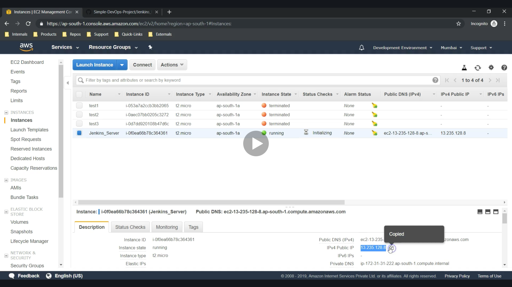
  * 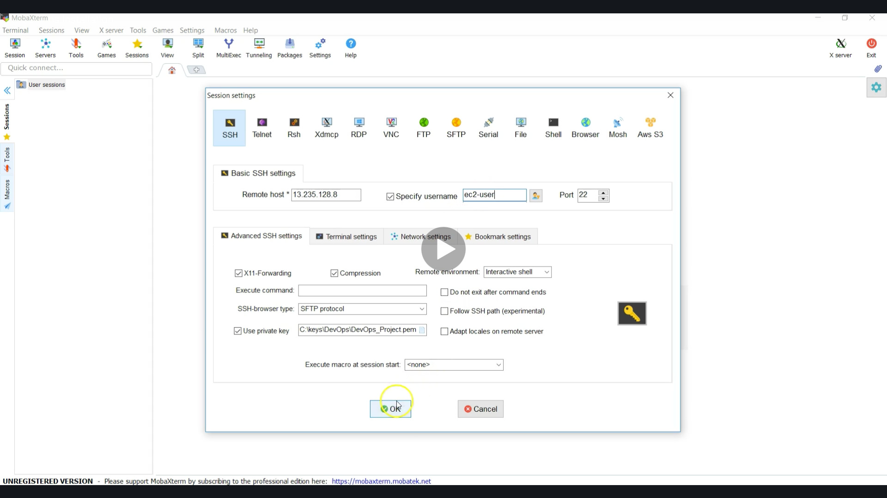

* How to Connect SSH?
  * [MacからAWS EC2へのSSH接続方法メモ](https://gloria.cool/blog/20200528-aws-ssh/)
    * Please run this.
      ```
      cd ~/.ssh/keys
      cp -p ダウンロードした鍵.pem ./

      chmod 600 ダウンロードした鍵.pem

      ssh EC2アカウント名@IP -i ダウンロードした鍵.pem (例: ssh ec2-user@11.11.11.11 -i key.pem)
      ```
  * [Macで公開鍵と秘密鍵を生成する方法(.sshの作成方法)](https://qiita.com/wakahara3/items/52094d476774f3a2f619)
    * Please run this if you have "/.ssh: No such file or directory".
      ```
      cd ~
      mkdir ~/.ssh
      ```
  * [SSH通信の接続と切断と終了の方法](https://www.hiramine.com/physicalcomputing/raspberrypi/ssh_connect.html)
    * Please run this.
      ```
      exit
      ```
  * Run this if you can connect AWS
    * You can change acconut like (root@ip-00-00-00-00 ~) 
      ```
      sudo su - 
      ```
    * 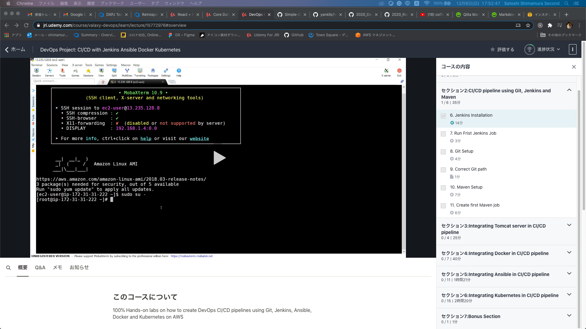

### 2nd : JAVA

* Flow of installing JAVA

### [Return to Contents](#contents)


