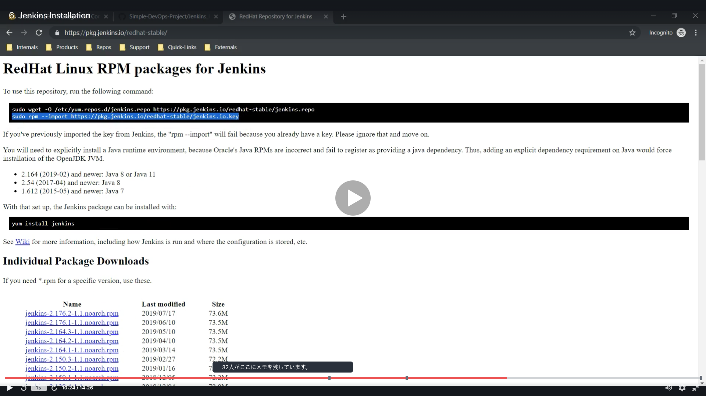
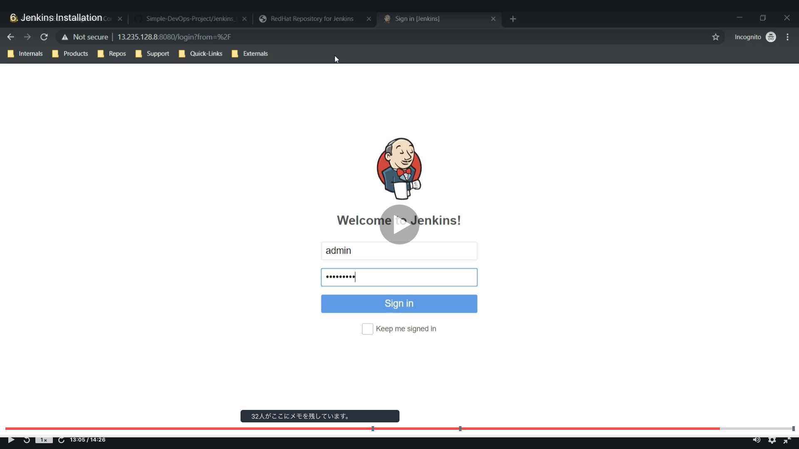
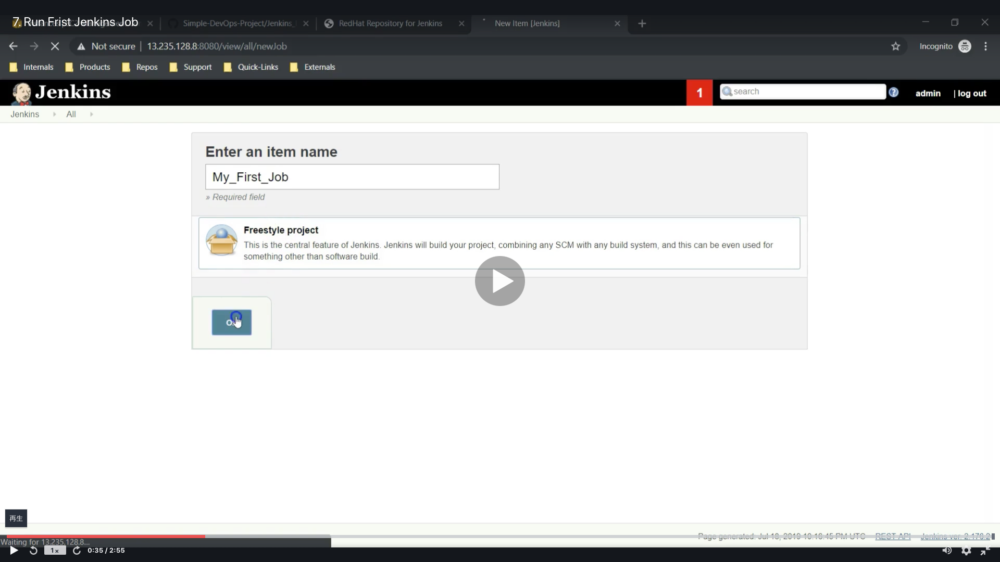

# CI/CD pipeline using Git, Jenkins and Maven

<a id="contents"></a>

## Contents

* [Installing Jenkins](#jenkins)
  * [1st : AWS Management Console](#jenkins_aws)
  * [2nd : java](#jenkins_java)
  * [3rd : jenkins](#jenkins_jenkins)
* [Run First Jenkins Job](#jenkins_first)

* You can enter the Jenkins
  * [How enter Jenkins?](#jenkins_enter)


<a id="jenkins"></a>

## Installing Jenkins

<a id="jenkins_aws"></a>

### 1st : AWS Management Console

* Flow of Create AWS Management Console
  * 
  * 
  * 
  * 
  * 
  * 
  * 
  * 
  * 
  * 
  * 
  * 
  * 
  * 

* How to Connect SSH?
  * [MacからAWS EC2へのSSH接続方法メモ](https://gloria.cool/blog/20200528-aws-ssh/)
    * Please run this.
      ```
      cd ~/.ssh/keys
      cp -p ダウンロードした鍵.pem ./

      chmod 600 ダウンロードした鍵.pem

      ssh EC2アカウント名@IP -i ダウンロードした鍵.pem (例: ssh ec2-user@11.11.11.11 -i key.pem)
      ```
  * [Macで公開鍵と秘密鍵を生成する方法(.sshの作成方法)](https://qiita.com/wakahara3/items/52094d476774f3a2f619)
    * Please run this if you have "/.ssh: No such file or directory".
      ```
      cd ~
      mkdir ~/.ssh
      ```
  * [SSH通信の接続と切断と終了の方法](https://www.hiramine.com/physicalcomputing/raspberrypi/ssh_connect.html)
    * Please run this.
      ```
      exit
      ```
  * Run this if you can connect AWS
    * You can change acconut like (root@ip-00-00-00-00 ~) 
      ```
      sudo su - 
      ```
    * 

### [Return to Contents](#contents)

<a id="jenkins_java"></a>

### 2nd : java

* Flow of installing java
  * 
  * 
  * 
  * 
  * 
  * 

* Run these commands.
  * Install java
    ```
    yum install java-1.8*
    ```
  
  * Check it and Get the path
    ```
    find /usr/lib/jvm/java-1.8* | head -n 3
    ```
    * Then you can get the path like (/usr/lib/jvm/java-1.8.0-openjdk-1.8.0.265.b01-1.amzn2.0.1.x86_64)
  
  * Move to .bash_profile
    ```
    cd ~
    vi .bash_profile
    ```

  * Add some text under (# User specific environment and startup programs)
    ```
    JAVA_HOME=/usr/lib/jvm/java-1.8.0-openjdk-1.8.0.265.b01-1.amzn2.0.1.x86_64
    PATH=$PATH:$HOME/bin:$JAVA
    ```

  * Exit .bash_profile
    ```
    :wq
    ```

  * Check tha path (you need logout onece)
    ```
    exit
    sudo su -
    echo $JAVA_HOME
    ```
    * Then you can see the path like (/usr/lib/jvm/java-1.8.0-openjdk-1.8.0.265.b01-1.amzn2.0.1.x86_64)

### [Return to Contents](#contents)

<a id="jenkins_jenkins"></a>

### 3rd : jenkins

* Flow of installing java
  * 
  * 
  * 
  * 
  * 
  * 
  * 
  * 
  * 
  * 
  * 
  * 
  * 
  * 
  * 
  * 
  * 
  * 
  * 
  * 
  * 
  * 
  * 

* Run these commands.
  * Before installing jenkins, Please download this
    * [Jenkins Redhat Packages](https://pkg.jenkins.io/redhat-stable/)
    ```
    sudo wget -O /etc/yum.repos.d/jenkins.repo https://pkg.jenkins.io/redhat-stable/jenkins.repo

    sudo rpm --import https://pkg.jenkins.io/redhat-stable/jenkins.io.key
    ```

  * Install jenkins
    ```
    yum install jenkins
    ```
  
  * Then, check the jenkins service
    ```
    service jenkins start
    service jenkins status
    ```
  
  <a id="jenkins_enter"></a>

  * After, check at webpage
    * example) 3.14.146.56:8080
    * You need password, so run this and get password
    ```
    cat /var/lib/jenkins/secrets/initialAdminPassword
    ``` 
    * Then you have like (f632175e84a54c1dbf29a86e6f21aff3)
    * You should change your password at admin/configure (21aff3gg)
      * Next time, you can enter (ID:admin, pass:21aff3gg)
    
    * Next, you must change at manage Jenkins / Global Tool Configuration
      * JAVA_HOME
      * /usr/lib/jvm/java-1.8.0-openjdk-1.8.0.265.b01-1.amzn2.0.1.x86_64
        * If you want to see it, run this
        ```
        echo $JAVA_HOME
        ```

### [Return to Contents](#contents)


<a id="jenkins_first"></a>

## Run First Jenkins Job

* Flow of running first jenkins job.
  * 
  * 
  * 
  * 
  * 
  * 
  * 
  * 
  * 
  * 

### [Return to Contents](#contents)

