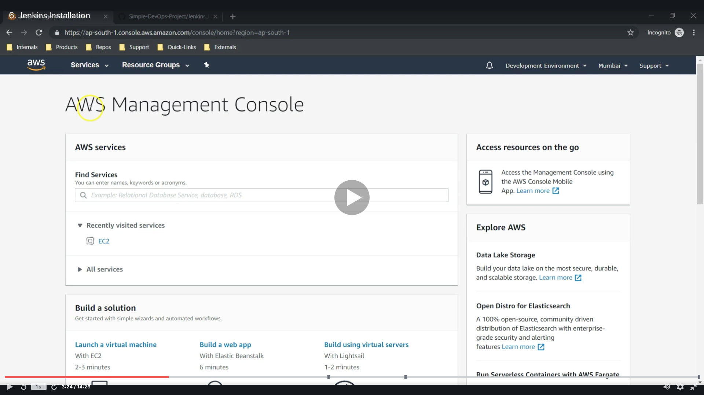

# Integrating Tomacat Server in CI/CD Pineline

## Contents

* [Installing Jenkins](#jenkins)

## Installing Jenkins

* Flow of Create AWS Management Console
  * 

### [Return to Contents](#contents)

