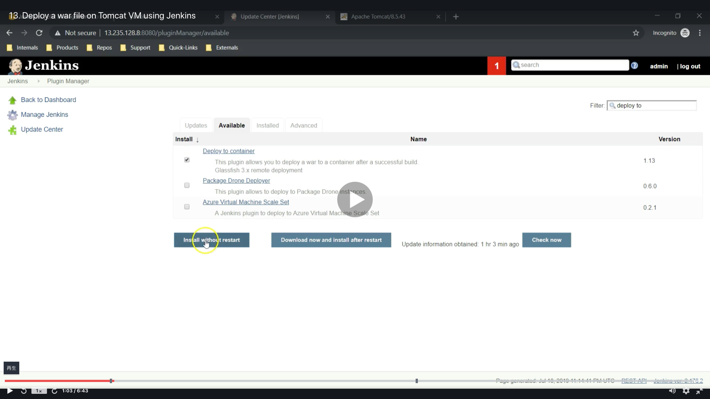
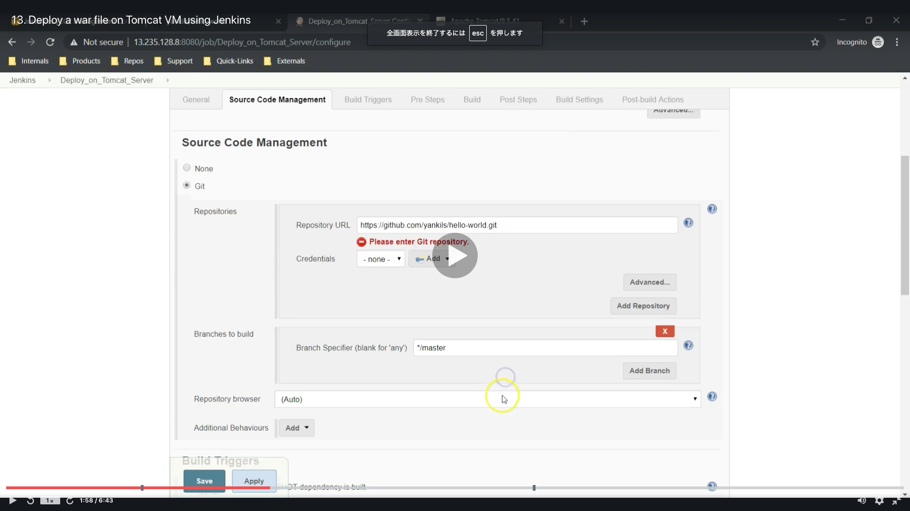

# Integrating Tomacat Server in CI/CD Pineline

<a id="contents"></a>

## Contents

* [Setup Tomcat Server](#tomcat_set)
* [Deploy a war file on Tomcat VM using Jenkins](#tomcat_deploy)
* [Deploy on VM through PollSCM](#tomcat_vm)


<a id="tomcat_set"></a>

## Setup Tomcat Server

* Flow of Setup Tomcat Server
  * 
  * 
  * 
  * 
  * 
  * 
  * 
  * 
  * 
  * 
  * 
  * 
  * 
  * 
  * 
  * 
  * 
  * 
  * 
  * 
  * 
  * 
  * 
  * 
  * 
  * 
  * 
  * 
  * 
  * 
  * 
  * 
  * 

<a id="tomcat_login"></a>

* Running these commands.
  * You need IPv4 Public IP (18.221.14.206)
  ```
  cd .ssh
  ssh ec2-user@18.221.14.206 -i DevOps_project.pem
  ```

* You need tomcat URL
  * https://ftp.yz.yamagata-u.ac.jp/pub/network/apache/tomcat/tomcat-8/v8.5.60/bin/apache-tomcat-8.5.60.tar.gz
  ```
  sudo su - (Then, root@tomcat ~)
  cd /opt
  wget https://ftp.yz.yamagata-u.ac.jp/pub/network/apache/tomcat/tomcat-8/v8.5.60/bin/apache-tomcat-8.5.60.tar.gz
  ```
* Change filename to Tomcat
  ```
  ls
  tar -xvzf apache-tomcat-8.5.60.tar.gz
  ls
  mv apache-tomcat-8.5.60 tomcat
  ls
  cd tomcat/
  ls
  ```
* Please install Java before running under commands
  ```
  cd bin
  ls
  ./startup.sh
  ```
  * If you have any error, check this page [LINIXにtomcatとJAVAをインストールしてservlet環境を整え少しでも独学す。](https://senbiki.wordpress.com/2012/09/08/linix%E3%81%ABtomcat%E3%81%A8java%E3%82%92%E3%82%A4%E3%83%B3%E3%82%B9%E3%83%88%E3%83%BC%E3%83%AB%E3%81%97%E3%81%A6servlet%E7%92%B0%E5%A2%83%E3%82%92%E6%95%B4%E3%81%88%E3%82%8B%E3%80%82/)
* Find file
  ```
  find / -name context.xml
  ```
* Edit context.xml
  ```
  vi /opt/tomcat/webapps/manager/META-INF/context.xml
  <!--  <Valve className="org.apache.catalina.valves.RemoteAddrValve"
         allow="127\.\d+\.\d+\.\d+|::1|0:0:0:0:0:0:0:1" /> -->
  ```
  ```
  vi /opt/tomcat/webapps/host-manager/META-INF/context.xml
  <!--  <Valve className="org.apache.catalina.valves.RemoteAddrValve"
         allow="127\.\d+\.\d+\.\d+|::1|0:0:0:0:0:0:0:1" /> -->
  ```
* Shutdown and start
  ```
   ./shutdown.sh 
   ./startup.sh
  ```
* Edit username and password
  ```
  pwd
  cd ..
  pwd
  ls
  cd conf/
  ls
  vi tomvat-users.xml
  ```
  ```
   <role rolename="manager-gui"/>
   <role rolename="manager-script"/>
   <role rolename="manager-jmx"/>
   <role rolename="manager-status"/>
   <user username="admin" password="admin" roles="manager-gui, manager-script, manager-jmx, manager-status"/>
   <user username="deployer" password="deployer" roles="manager-script"/>
   <user username="tomcat" password="s3cret" roles="manager-gui"/>
  ```
  ```
  cd ../bin/
  ls -l
  ./shutdown.sh
  ./startup.sh
  ```
* enter tomcat
  * user : admin
  * pass : admin

### [Return to Contents](#contents)


<a id="tomcat_deploy"></a>

## Deploy a war file on Tomcat VM using Jenkins

* Flow of Setup Tomcat Server
  * 
  * 
  * 
  * 
  * 
  * 
  * 
  * 
  * 
  * 
  * 
  * 
  * 
  * 
  * 
  * 
  * 
  * 
  * 
  * 
  * 
  * 
  * 
  * 

* Run these commends
  * You need running at Tomcat server.
    * [chack it to login](#tomcat_login)
  ```
  cat /opt/tomcat/conf/tomcat-users.xml
  ```
  * Then you can get these 
    * username : deployer
    * password : deployer
  
  * You need URL like (http://18.221.14.206:8080/)

  * Before building, check it 
    ```
    cd /opt/tomcat
    ls
    cd webapps/
    ls -l
    ```
  
  * Check the URL
    ```
    ls -l
    ```
    * Then, go to (http://18.221.14.206:8080/webapp)

### [Return to Contents](#contents)


<a id="tomcat_vm"></a>

## Deploy on VM through PollSCM

* Flow of Setup Tomcat Server
  * 

* Run these commands.
  * Before running this, move at jenkins
  ```
  git clone https://github.com/yankils/hello-world.git
  cd hello-world
  git pull
  ```
  ```
  cd webapp/src/main/webapp/
  ls
  cat index.jsp
  ```


