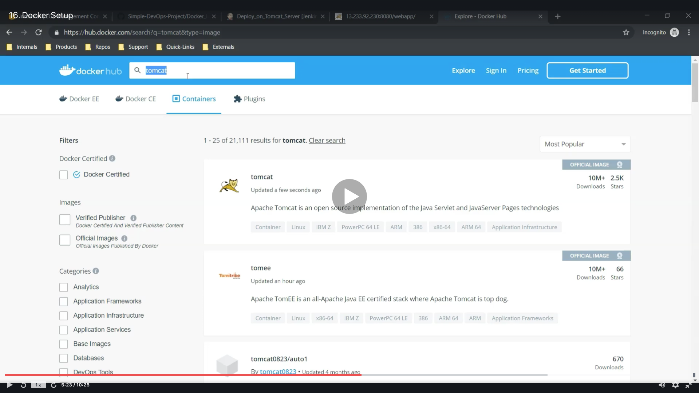
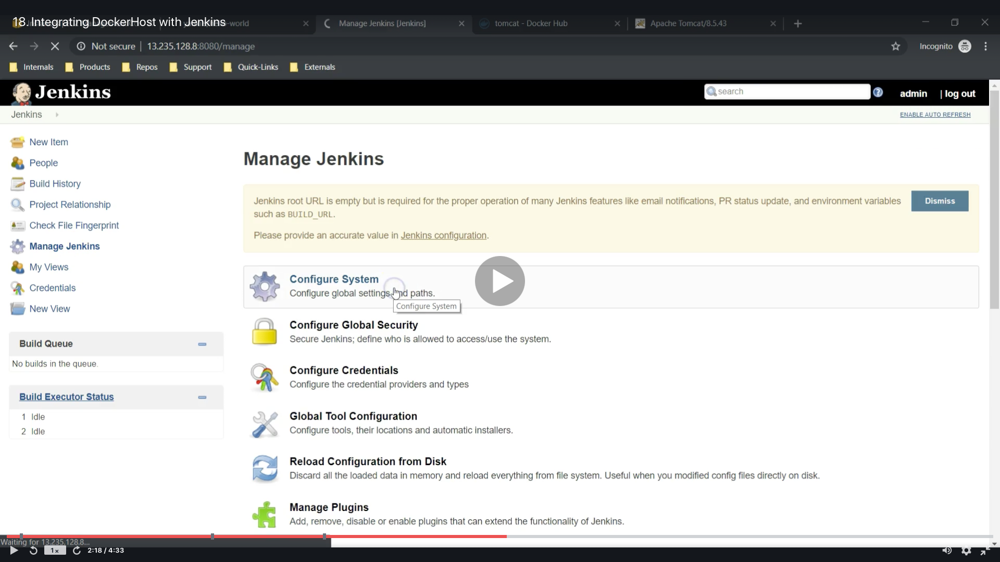

# Integrating Docker in CI/CD Pipeline

<a id="contents"></a>

## Contents

* [Docker Setup](#docker_set)
* [Docker*Tomcat Image Issue](#docker_iss)
* [Integrating DockerHost With Jenkins](#docker_jen)
* [Jenkins Job to Copy Artifactson to DockerHost](#docker_job)
* [Create a Dockerfile](#docker_file)

### Trouble
* If you want open port XXXX, check [this](https://forums.aws.amazon.com/thread.jspa?threadID=307722)


<a id="docker_set"></a>

## Docker Setup

* Flow of Setup Docker
  * 
  * 
  * 
  * 
  * 
  * 
  * 
  * 
  * 
  * 
  * 
  * 
  * 
  * 
  * 
  * 
  * 
  * 
  * 
  * 
  * 
  * 
  * 
  * 
  * 
  * 

* Run these commands
  ```
  hostname docker-host
  sudo su -
  yum install docker
  ```
  ```
  service docker start
  service docker status
  docker ps
  ```
  * check this page
    * https://hub.docker.com/
    * Search Tomcat
  * Image
  ```
  docker image ls
  docker pull tomcat:latest
  docker images
  docker run --name tomcat-container -p 8080:8080 tomcat:latest
  ``` 
  * You can't open tomcat page, but you will be able to open after next lesson.
  ```
  docker ps
  docker ps -a
  docker rm 2ef49f6c14a7
  docker run --name tomcat-container -p 8080:8080 tomcat:latest
  ```

### [Return to Contents](#contents)


<a id="docker_iss"></a>

## Docker * Tomcat Image issue

* Flow
  * 
  * 
  * 
  * 
  * 
  * 
  * 
  * 
  * 
  * 

* Commands
  * open tomcat page
  ```
  docker images
  docker ps -a
  docker rm 58ee54e9dcd3
  ```
  ```
  docker run -d --name tomcat-container -p 8080:8080 tomcat
  docker ps -a
  ```
  ```
  docker exec -it tomcat-container /bin/bash
  ls
  cd webapps
  ls
  cd ..
  cd webapps.dist/
  ls
  ```
  ```
  cp -R * ../webapps
  cd ../webapps
  ls
  exit
  ```
  * check docker page
    * https://hub.docker.com/_/tomcat
  ```
  docker images
  docker pull tomcat:8.0
  docker images
  ```
  * run another tomcat
    * You must need open port 8081
  ```
  docker run -d --name tomcat-8 -p 8081:8080 tomcat:8.0
  docker ps -a
  ```
  * If you want restart docker container, run this
  ```
  docker restart b6fe1e5b8656 
  ```

### [Return to Contents](#contents)


<a id="docker_jen"></a>

## Integrating DockerHost With Jenkins

* Flow
  * 
  * 
  * 
  * 
  * 
  * 
  * 
  * 
  * 
  * 
  * 
  * 
  * 
  * 
  * 
  * 
  * 
  * 

* Commands
  * use docker-host
  ```
  useradd dockeradmin
  passwd dockeradmin
  ```
  * pass : 21aff3gg
  ```
  cat /etc/group
  usermod -aG docker dockeradmin
  id dockeradmin
  ```
  * check the path
  ```
  pi addr
  vi /etc/ssh/sshd_config
  service sshd reload
  ```

### [Return to Contents](#contents)


<a id="docker_job"></a>

## Jenkins Job to Copy Artifactson to DockerHost

* Flow
  * 
  * 
  * 
  * 
  * 
  * 
  * 
  * 
  * 
  * 
  * 
  * 
  * 
  * 
  * 
  * 
  * 
  * 

* Commands
  * work at jenkins
  ```
  cd /var/lib/jenkins/workspace
  pwd
  ls
  cd Deploy_on_Tomcat_Server/
  ls
  cd webapp/
  ls
  cd target
  pwd
  ```
  * work at docker-host
  ```
  cd /home/dockeradmin
  su - dockeradmin
  pwd
  whoami
  ```
  ```
  cd webapp/target/
  ls
  pwd
  ```
  ```
  cd ..
  cd ~
  ls
  rm -rf webapp/
  ```
  * build again, then check
  ```
  ls
  pwd
  ```

### [Return to Contents](#contents)


<a id="docker_file"></a>

## Create a Dockerfile

* Flow
  * 

* Commands
  * work at dockeradmin
  ```
  su - dockeradmin
  ls
  vi Dockerfile
  ```
  * write at Dockerfile
  ```
  FROM tomcat:latest

  MAINTAINER AR Shankar

  COPY ./webapp.war /usr/local/tomcat/webapps
  ```
  * work at dockeradmin
  ```
  docker ps
  ls
  docker build -t devops-project .
  docker images
  docker run --name devops-container -p 8080:8080 devops-project
  ```
  ```
  docker ps -a
  docker rm 52ea2d02d244
  docker run -d --name devops-container -p 8080:8080 devops-project
  ```

### [Return to Contents](#contents)


