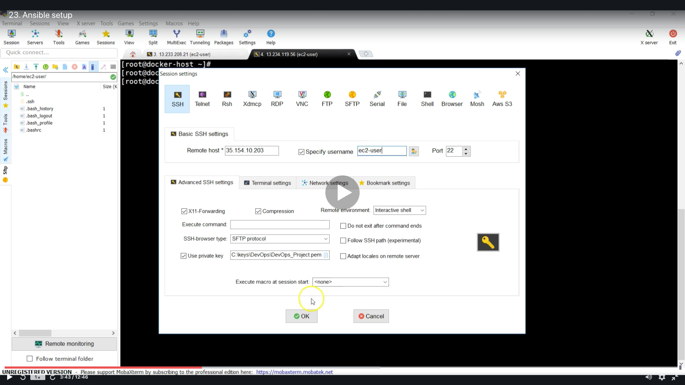

# Integrating Ansible in CI/CD pipeline

<a id="contents"></a>

## Contents

* [Ansible Setup](#ansible_set)
* [Integrating Ansible with Jenkins](#ansible_jen)
* [Creating an Ansible Playbook](#ansible_book)

### Trouble
* Cannot connect to the Docker daemon at unix:///var/run/docker.sock. Is the docker daemon running?
  * Run these commands
  ```
  service docker status
  sudo service docker start
  ```
  * [WSL上でDockerを動かす際に躓いたこと](https://qiita.com/neight0903/items/ef0e2170b712b194c3fc)


<a id="ansible_set"></a>

## Ansible Setup

* Flow
  * 
  * 
  * 
  * 
  * 
  * 
  * 
  * 
  * 
  * 
  * 
  * 
  * 
  * 
  * 
  * 
  * 
  * 
  * 
  * 
  * 
  * 
  * 
  * 
  * 
  * 
  * 
  * 
  * 
  * 
  * 
  * 
  * 
  * 
  * 
  * 
  * 
  * 
  * 
  * 
  * 

* commands
  * work at ansible
  ```
  ssh ec2-user@18.222.204.55 -i DevOps_project.pem
  sudo su -
  yum install python
  python --version
  ```
  ```
  yum install python-pip
  pip install ansible
  ansible --version
  ```
  ```
  mkdir /etc/ansible
  useradd ansadmin
  passwd ansadmin
  ```
  * pass : 21aff3gg
  ```
  visudo
  ansadmin ALL=(ALL)       NOPASSWD: ALL
  ```
  ```
  yum install docker
  service docker status
  service docker start
  ```
  ```
  usermod -aG docker ansadmin
  vi /etc/ssh/sshd_config
  /Password
  ```
  * no → yes
  ```
  service sshd reload
  su - ansadmin
  ssh-keygen
  ```
  ```
  ls -la
  cd .ssh
  ls
  cd ..
  exit
  hostname ansible-control-node
  sudo su -
  ```
  * work at docker-host
  ```
  useradd ansadmin
  passwd ansadmin
  ```
  * pass : 21aff3gg
  ```
  ip addr
  ```
  * work at ansadmin
  ```
  su - ansadmin
  ssh-copy-id ansadmin@172.31.2.113
  ```
  * pass : 21aff3gg
  ```
  ssh ansadmin@172.31.2.113
  exit
  cd /etc/ansible
  ls
  sudo vi hosts
  ```
  ```
  172.31.2.113
  localhost
  ```
  ```
  ansible all -m ping
  ssh-copy-id localhost
  ```
  * pass: 21aff3gg

### [Return to Contents](#contents)


<a id="ansible_jen"></a>

## Integrating Ansible with Jenkins

* Flow
  * 
  * 
  * 
  * 
  * 
  * 
  * 
  * 
  * 
  * 
  * 
  * 
  * 
  * 

* commands
  * work at ansible-control-node
  ```
  ip addr
  ```
  * pass: 21aff3gg
  ```
  cd /opt
  sudo mkdir docker
  sudo chown -R ansadmin:ansadmin /opt/docker
  ls -l /opt
  ```
  ```
  cd docker
  ls -l
  pwd
  ```
  * You can see the file 'webapp.war' after building
  ```
  ls
  ```

### [Return to Contents](#contents)


<a id="ansible_book"></a>

## Creating an Ansible Playbook

* Flow
  * 
  * 
  * 
  * 
  * 
  * 
  * 
  * 
  * 
  * 
  * 
  * 
  * 

* commands
  * work at ansible, (ansible-control-node docker)
  ```
  su - ansadmin
  cd /opt/docker
  ls
  pwd
  ```
  * work at docker-host
  ```
  cd /home/dockeradmin/
  ls
  cat Dockerfile
  ```
  * work at ansible
  ```
  vi Dockerfile
  FROM tomcat:latest
  
  MAINTAINER AR Shankar

  COPY ./webapp.war /usr/local/tomcat/webapps
  ```
  * [Ansibleのローカル実行(ansible-playが動かない時)](https://qiita.com/hiroyuki_onodera/items/e6d0d308eb44e26fa03f)
  ```
  vi simple-devops-image.yml
  ---
  - hosts: localhost
    become: true
  
    tasks:
    - name: build docker image using war file
      command: docker build -t simple-devops-image .
      args:
        chdir: /opt/docker
  ```
  ```
  docker images
  docker ps -a
  ls
  cat /etc/ansible/hosts
  cat simple-devops-image.yml
  ansible-playbook -i hosts simple-devops-image.yml --check
  ansible-playbook -i hosts simple-devops-image.yml
  docker images
  ```
  ```
  ---
  vi simple-devops-image.yml
  - hosts: localhost
    become: true

    tasks:
    - name: build docker image using war file
      command: docker build -t simple-devops-image .
      args:
        chdir: /opt/docker

    - name: create container using simple-devops-image
      command: docker run -d --name simple-devops-container -p 8080:8080 simple-devops-image
  ```
  ```
  mv simple-devops-image.yml simple-devops-project.yml
  ansible-playbook -i hosts simple-devops-project.yml
  docker images
  docker ps -a
  ```
  * You can open tomcat page if you run these
  ```
  docker exec -it simple-devops-container /bin/bash
  cd webapps.dist/
  cp -R * ../webapps
  cd ../webapps
  ```

### [Return to Contents](#contents)


